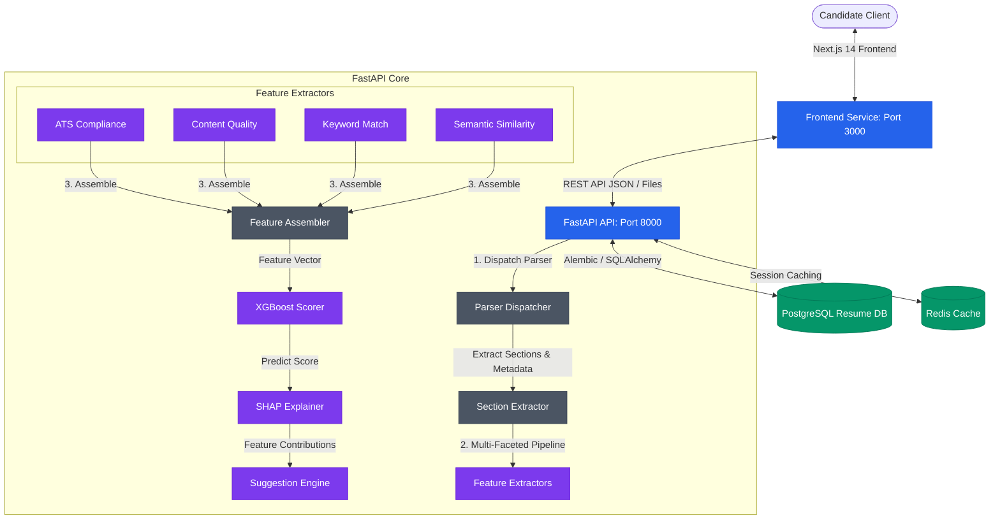

# 📄 Resume Score Checker ML

An enterprise-grade, machine-learning-powered **Resume Score Checker & ATS Optimizer**. This application uses a multi-faceted feature extraction pipeline, a trained **XGBoost regressor**, and **SHAP (SHapley Additive exPlanations)** to score resumes against target roles or job descriptions and provide explainable, actionable recommendations to candidates.

---

## 🚀 Badges & Tech Stack
[](https://fastapi.tiangolo.com/)
[](https://nextjs.org/)
[](https://www.typescriptlang.org/)
[](https://xgboost.readthedocs.io/)
[](https://github.com/shap/shap)
[](https://www.postgresql.org/)
[](https://redis.io/)
[](https://docs.docker.com/compose/)

---

## 🏗️ System Architecture

The following diagram illustrates the interaction between the frontend client, FastAPI backend, database, cache, parser dispatcher, and the Machine Learning evaluation engine (XGBoost + SHAP).



---

## ✨ Key Features

- 📑 **Advanced Document Parsing**: Supports uploading resumes in multiple formats. Automatically analyzes structural components (headers, footer, sections, layout) and flags issues like scanning artifacts (unreadable text), complex column formats, nested tables, images, and special character ratios.
- 🧪 **Multi-Stage Feature Extraction**:
  - **ATS Compliance**: Evaluates file type, page and word count constraints, and compatibility issues.
  - **Content Quality**: Examines key section completeness (Education, Experience, Skills, Projects) and validates item distributions.
  - **Keyword matching**: Uses direct token/frequency mapping to spot missing critical skills and keywords from a Job Description.
  - **Semantic Relevance**: Leverages NLP techniques (including spaCy) to match semantic contexts of work history and skills against target role descriptions.
- 🤖 **Explainable AI with XGBoost & SHAP**:
  - Scoring is handled via a trained **XGBoost Regressor** that generates a normalized score between 0 and 100.
  - Predictions are parsed through a **SHAP (SHapley Additive exPlanations)** engine, returning the exact waterfall data representing the positive or negative contribution of each feature towards the final grade.
- 💡 **Actionable Suggestion Engine**: Dynamically analyzes the SHAP waterfall data and ATS/Content check failures to generate tailored recommendations (e.g. *"Your experience density has a strong negative contribution (-8.5 pts). Expand your project descriptions."*).
- 🧹 **Automatic Data Maintenance**: Auto-cleans expired resume records in the database based on lifespan rules.

---

## 🛠️ Technological Stack

| Category | Component | Details |
| :--- | :--- | :--- |
| **Backend** | FastAPI | Async routing, Pydantic data validation, modular routers, dependency injection. |
| **Frontend** | Next.js 14 | Built on React, modern routing, dynamic score visualization dashboards. |
| **Database** | PostgreSQL | Persistent relational storage for parsed resumes, scores, feature vectors, and recommendations. Managed via **SQLAlchemy (Async)** and versioned using **Alembic**. |
| **Caching / Broker** | Redis | Caching Layer & session key management. |
| **Machine Learning**| XGBoost | High-performance gradient boosted tree regression model. |
| **Interpretability**| SHAP | Explains model output using game-theoretic Shapley values to pinpoint score impacts. |
| **NLP** | spaCy | Named Entity Recognition (NER), linguistic matching, and phrase mapping. |
| **Containerization**| Docker Compose | Multi-container setups for seamless local deployment. |

---

## 🧠 Machine Learning Pipeline

```
Raw Resume Content & JD
  │
  ▼
[Section Extractor] ──► Parse sections (Skills, Work History, Education, etc.)
  │
  ▼
[Feature Extraction Pipeline]
  ├── ATS Features: word count, layout checks, scanned PDF flag
  ├── Content Features: section density, formatting completeness
  ├── Keyword Features: token match ratio with Job Description
  └── Semantic Features: contextual text similarity with target role
  │
  ▼
[Feature Assembler] ──► Flattens vectors into a 1D NumPy array
  │
  ▼
[XGBoost Scorer] ──► Infers overall score (0 - 100)
  │
  ▼
[SHAP Explainer] ──► Derives feature contributions (Waterfall & Scatter plot)
  │
  ▼
[Suggestion Engine] ──► Recommends optimizations based on SHAP importances
```

> [!NOTE]
> The model can be trained or re-evaluated locally with custom datasets by executing the training pipeline script.

---

## 🔌 API Reference (FastAPI)

The API is fully documented with OpenAPI spec. Access the interactive swagger UI at `http://localhost:8000/api/docs`.

### 1. Upload Resume
* **Endpoint**: `POST /api/v1/resume/upload_resume`
* **Content-Type**: `multipart/form-data`
* **Response**:
```json
{
  "resume_id": "9b1deb4d-3b7d-4bad-9bdd-2b0d7b3dcb6d",
  "filename": "john_doe_resume.pdf",
  "word_count": 482,
  "page_count": 1,
  "ats_flags": {
    "tables_detected": false,
    "columns_detected": true,
    "images_detected": false,
    "special_chars_ratio": 0.04,
    "is_scanned_pdf": false
  },
  "preview_text": "Experienced Software Engineer with a passion for building high-performance systems...",
  "warnings": []
}
```

### 2. Score & Analyze Resume
* **Endpoint**: `POST /api/v1/resume/score_resume/{resume_id}`
* **Payload**:
```json
{
  "job_description": "Seeking a Backend Engineer proficient in Python, FastAPI, and Postgres. Knowledge of XGBoost is a plus.",
  "target_role": "Backend Engineer"
}
```
* **Response**:
```json
{
  "resume_id": "9b1deb4d-3b7d-4bad-9bdd-2b0d7b3dcb6d",
  "score_id": "d38d0112-70b1-4566-ae9d-92736e4f3a3f",
  "overall_score": 83.5,
  "ats_score": 90.0,
  "content_score": 85.0,
  "keyword_score": 75.0,
  "semantic_score": 82.0,
  "grade": "B+",
  "explanation_text": "Your resume shows strong semantic alignment with the role, but has keyword gaps.",
  "suggestions": [
    {
      "category": "keyword",
      "impact": -8.5,
      "message": "Add key terms: 'XGBoost', 'Postgres' to match the job description."
    }
  ],
  "keyword_gaps": ["XGBoost", "Postgres"],
  "waterfall_data": {
    "base_value": 70.0,
    "values": [10.0, 5.0, -5.0, 3.5],
    "feature_names": ["ats_score", "content_score", "keyword_score", "semantic_score"]
  },
  "processing_time_ms": 142
}
```

---

## 🏃 Getting Started

### 📋 Prerequisites
- Python 3.10+
- Node.js 18+ & npm
- Docker & Docker Compose (optional, for containerized run)

### Local Configuration
1. Clone this repository.
2. Copy the `.env.example` file to `.env`:
   ```bash
   cp .env.example .env
   ```
3. Customize configuration values in `.env` (database connection URLs, file limits, environment).
4. Navigate to the frontend directory, install npm packages, and verify compilation:
   ```bash
   cd frontend
   npm install
   npm run build
   ```


### Setup and Running with Makefile

This project provides a `Makefile` to simplify setup, training, and execution:

| Command | Action |
| :--- | :--- |
| `make install` | Installs local python backend requirements and npm packages for frontend. |
| `make dev` | Launches the multi-container Docker Compose cluster. |
| `make test` | Executes backend tests using `pytest`. |
| `make lint` | Performs backend linting and type-checking (`flake8`, `mypy`, `black`). |
| `make build` | Builds docker container images. |
| `make migrate` | Applies database migrations using Alembic. |
| `make train` | Runs the machine learning training pipeline to export the XGBoost scorer. |
| `make demo` | Runs the simulation demo script. |

> [!TIP]
> Run `make train` before starting the application locally to generate the XGBoost Scorer model binary (`scorer.pkl`).

---

## 🐳 Docker Deployment

To launch the full ecosystem (FastAPI, Next.js, PostgreSQL, Redis) with a single command:

```bash
make dev
```

This will bootstrap:
- **FastAPI API Server**: [http://localhost:8000](http://localhost:8000)
- **Next.js Frontend**: [http://localhost:3000](http://localhost:3000)
- **PostgreSQL**: Port `5432`
- **Redis**: Port `6379`
